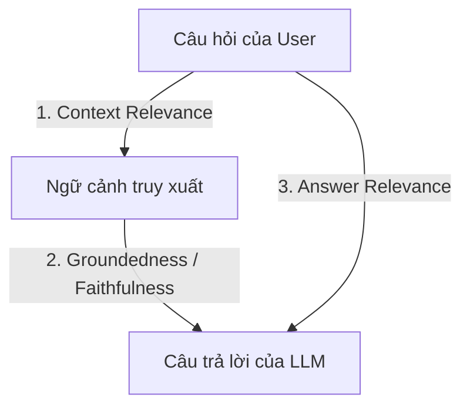

# Hướng Dẫn Phương Pháp Đánh Giá Hệ Thống RAG (Retrieval-Augmented Generation) Chuẩn Quốc Tế

Báo cáo này cung cấp cái nhìn toàn diện và mang tính học thuật cao về các phương pháp, chỉ số (metrics) dùng để đánh giá hiệu năng của một hệ thống RAG. Tài liệu này được biên soạn theo chuẩn công nghiệp và các nghiên cứu khoa học được công bố tại các hội nghị AI hàng đầu (ACL, EMNLP, NeurIPS).

---

## 1. Tổng Quan Về Đánh Giá RAG (Why & What to Evaluate?)

Một hệ thống RAG bao gồm hai thành phần cốt lõi hoạt động bổ trợ cho nhau:
1. **Bộ truy xuất thông tin (Retriever):** Trách nhiệm tìm kiếm các đoạn văn bản (chunks) liên quan nhất từ cơ sở dữ liệu vector.
2. **Bộ sinh câu trả lời (Generator):** Trách nhiệm đọc hiểu ngữ cảnh được truy xuất và sử dụng Mô hình ngôn ngữ lớn (LLM) để tổng hợp câu trả lời chính xác cho người dùng.

Để đánh giá một hệ thống RAG hiệu quả, chúng ta không thể chỉ đánh giá đầu ra cuối cùng, mà bắt buộc phải áp dụng phương pháp **phân rã thành phần (Component-level Evaluation)** và **đánh giá toàn diện (End-to-End Evaluation)**.

---

## 2. Mô Hình Đánh Giá Bộ Ba RAG (The RAG Triad)

Được đề xuất bởi tổ chức **TruLens**, mô hình **RAG Triad** là khung lý thuyết tiêu chuẩn công nghiệp giúp cô lập và đánh giá độc lập từng luồng trao đổi dữ liệu trong kiến trúc RAG.

### 2.1. Sự Liên Quan Của Ngữ Cảnh (Context Relevance)
*   **Định nghĩa:** Đánh giá xem các đoạn văn bản (chunks) do bộ Retriever tìm được có thực sự chứa thông tin cần thiết để trả lời câu hỏi hay không. Nó giúp phát hiện việc truy xuất thừa thông tin rác (noise) hoặc thiếu thông tin quan trọng.
*   **Cách đo đạc:** Sử dụng LLM làm giám khảo (LLM-as-a-judge) để trích xuất và chấm điểm tỷ lệ các câu có giá trị thông tin trong ngữ cảnh so với tổng số câu được truy xuất.
*   **Tài liệu tham khảo chính thống:** [TruLens RAG Triad Methodology](https://www.trulens.org/trulens/concepts/rag_triad/)

### 2.2. Tính Trung Thực / Độ Tin Cậy (Groundedness / Faithfulness)
*   **Định nghĩa:** Đánh giá xem câu trả lời của LLM có hoàn toàn dựa trên ngữ cảnh được cung cấp hay không. Chỉ số này cực kỳ quan trọng để phát hiện và ngăn chặn hiện tượng **ảo tưởng (Hallucination)** của LLM.
*   **Cách đo đạc:** Phân rã câu trả lời của LLM thành các luận điểm đơn lẻ (statements), sau đó dùng LLM giám khảo kiểm tra xem từng luận điểm đó có thể suy diễn trực tiếp từ ngữ cảnh hay không.
*   **Tài liệu tham khảo chính thống:** [TruLens Groundedness Evaluation](https://github.com/truera/trulens/blob/main/trulens_eval/README.md)

### 2.3. Sự Liên Quan Của Câu Trả Lời (Answer Relevance)
*   **Định nghĩa:** Đánh giá xem câu trả lời cuối cùng có thực sự giải đáp đúng trọng tâm câu hỏi của người dùng hay không (tránh việc trả lời lạc đề mặc dù thông tin trung thực với ngữ cảnh).
*   **Cách đo đạc:** Yêu cầu LLM giám khảo tự sinh lại $N$ câu hỏi từ câu trả lời đã tạo, sau đó đo độ tương đồng ngữ nghĩa (Cosine Similarity) giữa các câu hỏi tự sinh này với câu hỏi gốc của người dùng.
*   **Tài liệu tham khảo chính thống:** [TruLens Answer Relevance concept](https://www.trulens.org/)

---

## 3. Khung Đánh Giá Ragas (Retrieval Augmented Generation Assessment)

**Ragas** là bộ khung thư viện mã nguồn mở phổ biến nhất hiện nay chuyên biệt cho đánh giá RAG tự động mà không cần dữ liệu nhãn do con người gán (human-annotated datasets).

> [!NOTE]
> Nghiên cứu cốt lõi của Ragas được công bố trong bài báo khoa học:
> *Shahul Es et al., 2023.* **"Ragas: Automated Evaluation of Retrieval Augmented Generation"**.
> *   **Bài báo khoa học (arXiv):** [Ragas Paper - arXiv:2309.15217](https://arxiv.org/abs/2309.15217)
> *   **Tài liệu chính thức (Documentation):** [Ragas Official Docs](https://docs.ragas.io/)

### Các Chỉ Số Chi Tiết Theo Chuẩn Ragas:

| Tên Chỉ Số | Thành Phần Đánh Giá | Ý Nghĩa Kỹ Thuật | Phương Pháp Đo Đạc |
| :--- | :--- | :--- | :--- |
| **Faithfulness** | Generator | Đo mức độ trung thực của câu trả lời đối với ngữ cảnh (Tránh ảo tưởng). | $\text{Faithfulness Score} = \frac{\text{Số lượng luận điểm được chứng minh bởi ngữ cảnh}}{\text{Tổng số luận điểm trong câu trả lời}}$ |
| **Answer Relevance** | Generator | Đo mức độ liên quan của câu trả lời đối với câu hỏi gốc. | Dùng Embedding Model tính độ tương đồng ngữ nghĩa (Semantic Similarity) giữa câu hỏi gốc và câu hỏi sinh ngược. |
| **Context Recall** | Retriever | Đo lường xem Retriever có lấy đầy đủ thông tin để khớp với câu trả lời chuẩn (Ground Truth) không. | Phân tích xem mỗi câu trong Ground Truth có được bao phủ bởi Context đã truy xuất hay không (dùng LLM phân tích). |
| **Context Precision** | Retriever | Đo lường xem các thông tin liên quan nhất có được xếp ở các thứ hạng đầu của danh sách truy xuất không. | Tính toán dựa trên độ liên quan của từng chunk và thứ tự xếp hạng (giống công cụ xếp hạng tìm kiếm). |
| **Context Semantic Similarity** | Retriever | Đo độ tương đồng ngữ nghĩa thô giữa các chunk được truy xuất và Ground Truth. | Tính toán Cosine Similarity trực tiếp giữa vector nhúng của ngữ cảnh và câu trả lời chuẩn. |

---

## 4. Các Chỉ Số Truy Xuất Thông Tin Truyền Thống (Information Retrieval - IR Metrics)

Khi đánh giá hiệu năng của bộ **Retriever** (đặc biệt là khi so sánh giữa Dense Search, Sparse Search và Hybrid Search), các chỉ số IR truyền thống là bắt buộc:

### 4.1. Hit Rate (Tỷ lệ khớp - @K)
*   **Định nghĩa:** Tỷ lệ phần trăm các câu hỏi mà trong đó tài liệu chứa câu trả lời đúng (Ground Truth Chunk) nằm trong top $K$ tài liệu được truy xuất.
*   **Công thức:**
    $$\text{Hit Rate@K} = \frac{\text{Số câu hỏi tìm thấy tài liệu đúng trong Top K}}{\text{Tổng số câu hỏi kiểm thử}}$$
*   **Tài liệu tham khảo chính thống:** [Evaluation measures for information retrieval - Wikipedia](https://en.wikipedia.org/wiki/Evaluation_measures_(information_retrieval)#Hit_rate)

### 4.2. Mean Reciprocal Rank (MRR)
*   **Định nghĩa:** Đánh giá vị trí xuất hiện của tài liệu liên quan đầu tiên trong danh sách kết quả. Nếu tài liệu đúng nằm ở vị trí đầu tiên, điểm là $1$, vị trí thứ hai là $0.5$, cứ thế giảm dần.
*   **Công thức:**
    $$\text{MRR} = \frac{1}{|Q|} \sum_{i=1}^{|Q|} \frac{1}{\text{rank}_i}$$
    *(Trong đó $|Q|$ là tổng số câu hỏi, $\text{rank}_i$ là thứ hạng của tài liệu đúng đầu tiên cho câu hỏi thứ $i$)*.
*   **Tài liệu tham khảo chính thống:** [Mean Reciprocal Rank - Wikipedia](https://en.wikipedia.org/wiki/Mean_reciprocal_rank)

### 4.3. Normalized Discounted Cumulative Gain (NDCG)
*   **Định nghĩa:** Đo lường chất lượng xếp hạng của tài liệu truy xuất, có tính đến mức độ liên quan và thứ tự ưu tiên của tài liệu. NDCG phạt nặng nếu các tài liệu cực kỳ liên quan bị xếp ở cuối danh sách.
*   **Tài liệu tham khảo chính thống:** [NDCG - Wikipedia](https://en.wikipedia.org/wiki/Discounted_cumulative_gain#Normalized_DCG)

---

## 5. Chỉ Số So Sánh Chuỗi Văn Bản Học Thuật (Lexical & Semantic Overlap Metrics)

Để đánh giá chất lượng câu chữ sinh ra từ Generator so với câu trả lời mẫu của chuyên gia (Ground Truth), chúng ta kết hợp các chỉ số Lexical Overlap (khớp từ vựng) và Semantic Overlap (tương đồng ngữ nghĩa):

### 5.1. BLEU (Bilingual Evaluation Understudy)
*   **Định nghĩa:** Đo mức độ trùng lặp của các cụm từ gồm $N$ ký tự (N-grams) giữa câu sinh ra và câu mẫu. Thường dùng nhiều trong dịch thuật tự động.
*   **Tài liệu tham khảo chính thống:** *Papineni et al., 2002.* [BLEU: a Method for Automatic Evaluation of Machine Translation - ACL Anthology](https://aclanthology.org/P02-1040/)

### 5.2. ROUGE (Recall-Oriented Understudy for Gisting Evaluation)
*   **Định nghĩa:** Tập trung đo lường độ bao phủ (Recall) của các từ khóa quan trọng. **ROUGE-L** dựa trên chuỗi con chung dài nhất (Longest Common Subsequence) rất phù hợp cho tóm tắt và câu hỏi RAG.
*   **Tài liệu tham khảo chính thống:** *Chin-Yew Lin, 2004.* [ROUGE: A Package for Automatic Evaluation of Summaries - ACL Anthology](https://aclanthology.org/W04-1013/)

### 5.3. Semantic Similarity (Độ tương đồng ngữ nghĩa bằng SBERT)
*   **Định nghĩa:** Sử dụng mô hình Sentence-BERT để biến đổi toàn bộ câu thành vector ngữ nghĩa, sau đó tính Cosine Similarity. Chỉ số này khắc phục điểm yếu của BLEU/ROUGE khi câu trả lời dùng từ đồng nghĩa khác chữ viết.
*   **Tài liệu tham khảo chính thống:** *Reimers & Gurevych, 2019.* [Sentence-BERT: Sentence Embeddings using Siamese BERT-Networks - arXiv](https://arxiv.org/abs/1908.10084)

---

## 6. Cách Thực Thi Bộ Đánh Giá Trong Codebase Của Bạn (`11_run_evaluation.py`)

Trong dự án **Clef Internal AI Chat (RAG Module)**, bộ đánh giá của bạn (`ai/scripts/11_run_evaluation.py`) đã tích hợp hoàn hảo các nguyên lý khoa học trên để chạy ngoại tuyến (offline evaluation) một cách tối ưu nhất:

1.  **Dữ liệu đầu vào (Ground Truth):** Được sinh tự động từ `03_generate_qa_dataset.py` và chuẩn hóa nhãn bằng `09_fix_ground_truths.py` để đảm bảo 100% khớp thông tin tài liệu.
2.  **Đánh giá Retriever:** Tính toán chỉ số **Hit Rate** và đo **Semantic Similarity** của context nhằm tinh chỉnh cấu hình Hybrid Search.
3.  **Đánh giá Generator:** 
    *   Sử dụng độ tương đồng ngữ nghĩa **Semantic Similarity** (sử dụng Sentence-Transformers) làm chỉ số đo mức độ tiệm cận thông tin ngữ nghĩa của câu trả lời.
    *   Tích hợp các chỉ số so sánh văn bản truyền thống gồm **ROUGE-1, ROUGE-2, ROUGE-L** và **BLEU** để kiểm tra độ chính xác cú pháp và bảo toàn từ khóa nghiệp vụ của công ty.
    *   Thiết lập cơ chế chạy song song (Async) giúp đánh giá hàng trăm câu hỏi test nhanh chóng mà không gây nghẽn tài nguyên VRAM của GPU.
4.  **Trực quan hóa:** Kết quả chấm điểm được lưu dưới dạng CSV và tự động vẽ biểu đồ trực quan thông qua `12_plot_results.py` và xuất Dashboard HTML bằng `13_generate_dashboard.py` phục vụ báo cáo nghiệm thu dự án.
