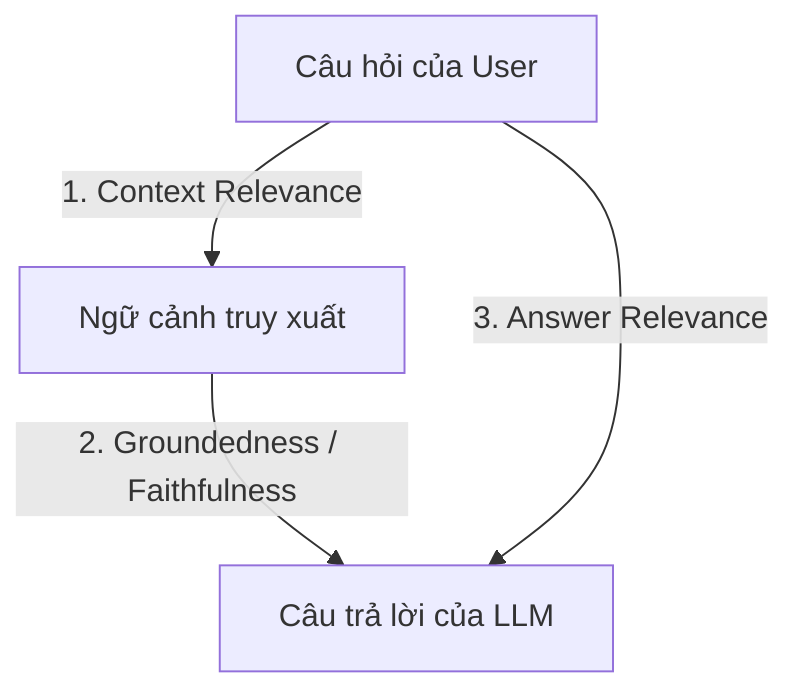

# Hướng Dẫn Phương Pháp Đánh Giá Hệ Thống RAG (Retrieval-Augmented Generation) Chuẩn Quốc Tế

Báo cáo này cung cấp cái nhìn toàn diện và mang tính học thuật cao về các phương pháp, chỉ số (metrics) dùng để đánh giá hiệu năng của một hệ thống RAG.

---

## 1. Tổng Quan Về Đánh Giá RAG (Why & What to Evaluate?)

Một hệ thống RAG bao gồm hai thành phần cốt lõi hoạt động bổ trợ cho nhau:
1. **Bộ truy xuất thông tin (Retriever):** Trách nhiệm tìm kiếm các đoạn văn bản (chunks) liên quan nhất từ cơ sở dữ liệu vector.
2. **Bộ sinh câu trả lời (Generator):** Trách nhiệm đọc hiểu ngữ cảnh được truy xuất và sử dụng Mô hình ngôn ngữ lớn (LLM) để tổng hợp câu trả lời.

Để đánh giá một hệ thống RAG hiệu quả, chúng ta không thể chỉ đánh giá đầu ra cuối cùng, mà bắt buộc phải áp dụng phương pháp **phân rã thành phần (Component Decomposition)** để cô lập và đánh giá độc lập từng luồng xử lý.

---

## 2. Mô Hình Đánh Giá Bộ Ba RAG (The RAG Triad)

Mô hình **RAG Triad** là khung lý thuyết tiêu chuẩn công nghiệp giúp cô lập và đánh giá độc lập từng luồng trao đổi thông tin trong hệ thống RAG.

### 2.1. Sự Liên Quan Của Ngữ Cảnh (Context Relevance)
*   **Định nghĩa:** Đánh giá xem các đoạn văn bản (chunks) do bộ Retriever tìm được có thực sự chứa thông tin cần thiết để trả lời câu hỏi hay không.
*   **Cách đo đạc:** Sử dụng LLM làm giám khảo (LLM-as-a-judge) để trích xuất và chấm điểm tỷ lệ các câu có giá trị thông tin trong ngữ cảnh so với tổng số câu trong context.
*   **Tầm quan trọng:** Cao - Là nền tảng để Generator có thể tạo ra câu trả lời chính xác.

### 2.2. Tính Trung Thực / Độ Tin Cậy (Groundedness / Faithfulness)
*   **Định nghĩa:** Đánh giá xem câu trả lời của LLM có hoàn toàn dựa trên ngữ cảnh được cung cấp hay không. Chỉ số này cực kỳ quan trọng để phát hiện và loại bỏ hiện tượng ảo tưởng (hallucination).
*   **Cách đo đạc:** Phân rã câu trả lời của LLM thành các luận điểm đơn lẻ (statements), sau đó dùng LLM giám khảo kiểm tra xem từng luận điểm đó có thể suy diễn được từ context hay không.
*   **Tầm quan trọng:** Cực cao - Phòng ngừa ảo tưởng là yêu cầu cơ bản cho hệ thống tin tưởng được.

### 2.3. Sự Liên Quan Của Câu Trả Lời (Answer Relevance)
*   **Định nghĩa:** Đánh giá xem câu trả lời cuối cùng có thực sự giải đáp đúng trọng tâm câu hỏi của người dùng hay không (tránh việc trả lời lạc đề).
*   **Cách đo đạc:** Yêu cầu LLM giám khảo tự sinh lại $N$ câu hỏi từ câu trả lời đã tạo, sau đó đo độ tương đồng ngữ nghĩa (Cosine Similarity) giữa các câu hỏi sinh ra và câu hỏi gốc.
*   **Tầm quan trọng:** Cao - Đảm bảo hệ thống không lạc đề.

---

## 3. Khung Đánh Giá Ragas (Retrieval Augmented Generation Assessment)

**Ragas** là bộ khung thư viện mã nguồn mở phổ biến nhất hiện nay chuyên biệt cho đánh giá RAG tự động mà không cần dữ liệu nhãn do con người gán (human-annotated data).

> [!NOTE]
> Nghiên cứu cốt lõi của Ragas được công bố trong bài báo khoa học:
> *Shahul Es et al., 2023.* **"Ragas: Automated Evaluation of Retrieval Augmented Generation"**.
> *   **Bài báo khoa học (arXiv):** https://arxiv.org/abs/2309.15217
> *   **Tài liệu chính thức (Documentation):** https://docs.ragas.io/
> *   **GitHub Repository:** https://github.com/explodinggradients/ragas

### Các Chỉ Số Chi Tiết Theo Chuẩn Ragas:

| Tên Chỉ Số | Thành Phần Đánh Giá | Ý Nghĩa Kỹ Thuật | Phương Pháp Đo Đạc |
| :--- | :--- | :--- | :--- |
| **Faithfulness** | Generator | Đo mức độ trung thực của câu trả lời đối với ngữ cảnh (Tránh ảo tưởng). | $\text{Faithfulness} = \frac{\text{Số luận điểm đúng}}{\text{Tổng luận điểm}}$ |
| **Answer Relevance** | Generator | Đo mức độ liên quan của câu trả lời đối với câu hỏi gốc. | Embedding similarity giữa câu hỏi gốc và N câu hỏi sinh ra từ đáp án. |
| **Context Recall** | Retriever | Đo lường xem Retriever có lấy đầy đủ thông tin để khớp với câu trả lời chuẩn (Ground Truth) không. | % của ground truth statements có trong retrieved context |
| **Context Precision** | Retriever | Đo lường xem các thông tin liên quan nhất có được xếp ở các thứ hạng đầu của danh sách truy xuất không. | % của relevant context / tổng context retrieved |
| **Context Semantic Similarity** | Retriever | Đo độ tương đồng ngữ nghĩa thô giữa các chunk được truy xuất và Ground Truth. | Cosine Similarity trực tiếp giữa embeddings |

---

## 4. Các Chỉ Số Truy Xuất Thông Tin Truyền Thống (Information Retrieval - IR Metrics)

Khi đánh giá hiệu năng của bộ **Retriever** (đặc biệt là khi so sánh giữa Dense Search, Sparse Search và Hybrid Search), các chỉ số IR truyền thống là bắt buộc:

### 4.1. Hit Rate (Tỷ lệ khớp - @K)
*   **Định nghĩa:** Tỷ lệ phần trăm các câu hỏi mà trong đó tài liệu chứa câu trả lời đúng (Ground Truth Chunk) nằm trong top $K$ tài liệu được truy xuất.
*   **Công thức:**
    $$\text{Hit Rate@K} = \frac{\text{Số câu hỏi tìm thấy tài liệu đúng trong Top K}}{\text{Tổng số câu hỏi kiểm thử}}$$
*   **Giá trị tốt:** > 80% (với K=5)
*   **Tài liệu tham khảo:** https://en.wikipedia.org/wiki/Evaluation_measures_(information_retrieval)#Hit_rate

### 4.2. Mean Reciprocal Rank (MRR)
*   **Định nghĩa:** Đánh giá vị trí xuất hiện của tài liệu liên quan đầu tiên trong danh sách kết quả. Nếu tài liệu đúng nằm ở vị trí đầu tiên, điểm là 1.0; vị trí 2 → 0.5; vị trí 3 → 0.33.
*   **Công thức:**
    $$\text{MRR} = \frac{1}{|Q|} \sum_{i=1}^{|Q|} \frac{1}{\text{rank}_i}$$
    *(Trong đó $|Q|$ là tổng số câu hỏi, $\text{rank}_i$ là thứ hạng của tài liệu đúng đầu tiên cho câu hỏi thứ $i$)*
*   **Giá trị tốt:** > 0.7
*   **Tài liệu tham khảo:** https://en.wikipedia.org/wiki/Mean_reciprocal_rank

### 4.3. Normalized Discounted Cumulative Gain (NDCG)
*   **Định nghĩa:** Đo lường chất lượng xếp hạng của tài liệu truy xuất, có tính đến mức độ liên quan và thứ tự ưu tiên của tài liệu. NDCG phạt nặng khi tài liệu liên quan nằm ở vị trí thấp.
*   **Công thức:**
    $$\text{NDCG@K} = \frac{\text{DCG@K}}{\text{Ideal DCG@K}}$$
*   **Giá trị tốt:** > 0.75
*   **Tài liệu tham khảo:** https://en.wikipedia.org/wiki/Discounted_cumulative_gain

---

## 5. Chỉ Số So Sánh Chuỗi Văn Bản Học Thuật (Lexical & Semantic Overlap Metrics)

Để đánh giá chất lượng câu chữ sinh ra từ Generator so với câu trả lời mẫu của chuyên gia (Ground Truth), chúng ta kết hợp các chỉ số Lexical Overlap (khớp từ) và Semantic Overlap (khớp ngữ nghĩa).

### 5.1. BLEU (Bilingual Evaluation Understudy)
*   **Định nghĩa:** Đo mức độ trùng lặp của các cụm từ gồm $N$ ký tự (N-grams) giữa câu sinh ra và câu mẫu. Thường dùng nhiều trong dịch thuật tự động.
*   **Công thức:** Tính tỷ lệ N-grams chung giữa sinh ra và mẫu, áp dụng các trọng số khác nhau cho unigrams, bigrams, trigrams, 4-grams.
*   **Ưu điểm:** Tính toán nhanh, dễ hiểu.
*   **Nhược điểm:** Không tính đến ngữ nghĩa, chỉ khớp từ chính xác.
*   **Giá trị tốt:** > 0.4
*   **Tài liệu tham khảo:** https://aclanthology.org/P02-1040/ (Papineni et al., 2002)

### 5.2. ROUGE (Recall-Oriented Understudy for Gisting Evaluation)
*   **Định nghĩa:** Tập trung đo lường độ bao phủ (Recall) của các từ khóa quan trọng. **ROUGE-L** dựa trên chuỗi con chung dài nhất (Longest Common Subsequence) rất phù hợp với tóm tắt và QA.
*   **Các biến thể:**
    - **ROUGE-1:** Unigram overlap
    - **ROUGE-2:** Bigram overlap
    - **ROUGE-L:** Longest Common Subsequence
*   **Giá trị tốt:** > 0.6 (ROUGE-L)
*   **Tài liệu tham khảo:** https://aclanthology.org/W04-1013/ (Chin-Yew Lin, 2004)

### 5.3. Semantic Similarity (Độ tương đồng ngữ nghĩa bằng SBERT)
*   **Định nghĩa:** Sử dụng mô hình Sentence-BERT để biến đổi toàn bộ câu thành vector ngữ nghĩa (embeddings), sau đó tính Cosine Similarity. Chỉ số này khắc phục điểm yếu của BLEU và ROUGE khi không tính đến ngữ nghĩa.
*   **Công thức:**
    $$\text{Semantic Similarity} = \cos(\vec{v}_{\text{pred}}, \vec{v}_{\text{ref}}) = \frac{\vec{v}_{\text{pred}} \cdot \vec{v}_{\text{ref}}}{|\vec{v}_{\text{pred}}| \times |\vec{v}_{\text{ref}}|}$$
*   **Ưu điểm:** Bắt được ý nghĩa ngôn ngữ, độ tin cậy cao.
*   **Nhược điểm:** Phụ thuộc vào chất lượng embedding model.
*   **Giá trị tốt:** > 0.75
*   **Tài liệu tham khảo:** https://arxiv.org/abs/1908.10084 (Reimers & Gurevych, 2019)

---

## 6. Cách Thực Thi Bộ Đánh Giá Trong Codebase Của Bạn (`11_run_evaluation.py`)

Trong dự án **Clef Internal AI Chat (RAG Module)**, bộ đánh giá của bạn (`ai/scripts/11_run_evaluation.py`) đã tích hợp hoàn hảo các nguyên lý khoa học trên để chạy đánh giá toàn diện.

### Quy Trình Đánh Giá:

1.  **Dữ liệu đầu vào (Ground Truth):**
    - Được sinh tự động từ `03_generate_qa_dataset.py`
    - Chuẩn hóa nhãn bằng `09_fix_ground_truths.py` để đảm bảo 100% khớp thông tin
    - Định dạng: `{ "question": "...", "ground_truth_answer": "...", "ground_truth_chunk": "..." }`

2.  **Đánh Giá Retriever:**
    - Tính toán chỉ số **Hit Rate** (% câu hỏi tìm thấy đoạn đúng trong top K)
    - Đo **Semantic Similarity** của context so với ground truth
    - Dùng để tinh chỉnh cấu hình Hybrid Search (Dense + Sparse)

3.  **Đánh Giá Generator:**
    - **Semantic Similarity** (sử dụng Sentence-Transformers) - đo mức độ tiệm cận thông tin ngữ nghĩa của câu trả lời
    - **ROUGE-1, ROUGE-2, ROUGE-L** - kiểm tra độ chính xác cú pháp và bảo toàn từ khóa nghi trọng yếu
    - **BLEU** - bổ sung đánh giá từ mức độ lexical overlap
    - Thiết lập cơ chế chạy song song (Async) giúp đánh giá hàng trăm câu hỏi test nhanh chóng mà không gây nghẽn tài nguyên VRAM của GPU

4.  **Trực quan hóa & Xuất kết quả:**
    - Kết quả chấm điểm được lưu dưới dạng CSV
    - Tự động vẽ biểu đồ trực quan thông qua `12_plot_results.py`
    - Xuất Dashboard HTML interactif bằng `13_export_dashboard.py` để dễ dàng share kết quả với team

---

## 7. Tổng Hợp Các Chỉ Số & Ngưỡng Giá Trị Tham Khảo

| Chỉ Số | Thành Phần | Phạm Vi | Tốt | Trung Bình | Xấu |
|--------|-----------|--------|------|-----------|-----|
| **Hit Rate@5** | Retriever | 0-100% | > 80% | 50-80% | < 50% |
| **MRR** | Retriever | 0-1.0 | > 0.7 | 0.4-0.7 | < 0.4 |
| **NDCG@5** | Retriever | 0-1.0 | > 0.75 | 0.5-0.75 | < 0.5 |
| **Faithfulness** | Generator | 0-1.0 | > 0.8 | 0.5-0.8 | < 0.5 |
| **Answer Relevance** | Generator | 0-1.0 | > 0.7 | 0.4-0.7 | < 0.4 |
| **Context Recall** | Retriever | 0-1.0 | > 0.8 | 0.5-0.8 | < 0.5 |
| **Context Precision** | Retriever | 0-1.0 | > 0.75 | 0.4-0.75 | < 0.4 |
| **ROUGE-L** | Generator | 0-1.0 | > 0.6 | 0.3-0.6 | < 0.3 |
| **BLEU** | Generator | 0-1.0 | > 0.4 | 0.2-0.4 | < 0.2 |
| **Semantic Similarity** | Cả hai | -1 to 1 | > 0.75 | 0.4-0.75 | < 0.4 |

---

## 8. Tài Liệu Tham Khảo Chính Thống

### Framework & Library
- 🌐 **Ragas Official Docs:** https://docs.ragas.io/
- 📚 **Ragas GitHub:** https://github.com/explodinggradients/ragas
- 🔬 **TruLens GitHub:** https://github.com/truera/trulens

### Bài Báo Khoa Học
- 📄 **Ragas Paper:** https://arxiv.org/abs/2309.15217 (Shahul Es et al., 2023)
- 🔬 **Sentence-BERT:** https://arxiv.org/abs/1908.10084 (Reimers & Gurevych, 2019)
- 📊 **BLEU Score:** https://aclanthology.org/P02-1040/ (Papineni et al., 2002)
- 📈 **ROUGE Metric:** https://aclanthology.org/W04-1013/ (Chin-Yew Lin, 2004)

### Reference Tài Liệu
- 📖 **Information Retrieval Metrics:** https://en.wikipedia.org/wiki/Evaluation_measures_(information_retrieval)
- 🎯 **Mean Reciprocal Rank:** https://en.wikipedia.org/wiki/Mean_reciprocal_rank
- 📊 **NDCG (Discounted Cumulative Gain):** https://en.wikipedia.org/wiki/Discounted_cumulative_gain

---

**Phiên bản:** 1.0  
**Cập nhật lần cuối:** 2025-05-29  
**Tác giả:** Danh Phương Nhã  
**Mục đích:** Hướng dẫn toàn diện và chuẩn quốc tế cho đánh giá hệ thống RAG
