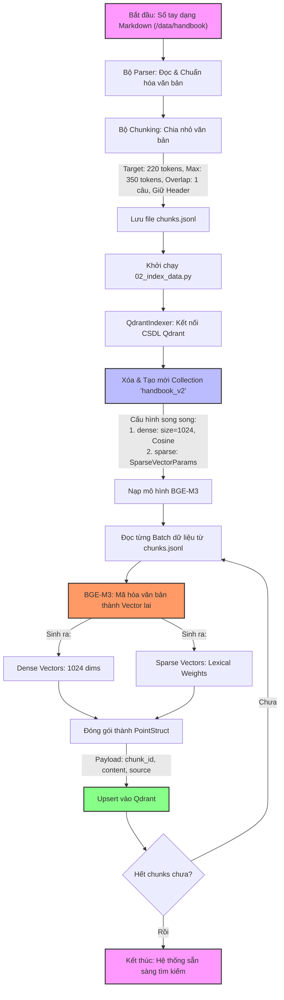

# TÀI LIỆU KỸ THUẬT: KIẾN TRÚC RAG VÀ HỆ THỐNG ĐÁNH GIÁ OFFLINE
**Clef Internal AI Chatbot (AI Module)**

Tài liệu này cung cấp mô tả chi tiết về cấu trúc luồng hoạt động RAG hiện tại và phương pháp đánh giá hiệu năng offline tự động cùng các liên kết tham khảo.

---

## 1. TỔNG QUAN KIẾN TRÚC RAG (PIPELINE ARCHITECTURE)

Hệ thống RAG sử dụng chiến lược **Tìm kiếm lai kết hợp (Advanced Hybrid Search)** kết hợp **Đánh giá lại (Reranking)** và mô hình sinh **LLM cục bộ (Local LLM)**.

*   **Mô hình nhúng (Embedding Model):** `BAAI/bge-m3` (Sinh song song Dense & Sparse Vector).
*   **Cơ sở dữ liệu Vector (Vector Store):** `Qdrant` (Collection: `handbook_v2`, kết hợp kết quả bằng thuật toán `RRF`).
*   **Mô hình xếp hạng lại (Reranker Model):** `BAAI/bge-reranker-v2-m3` (CrossEncoder).
*   **Mô hình sinh câu trả lời (Generator LLM):** `Qwen/Qwen2.5-1.5B-Instruct` (Quantization 4-bit).

---

## 2. LUỒNG HOẠT ĐỘNG CHI TIẾT (WORKFLOW DIAGRAMS)

### A. Luồng Lập Chỉ Mục Dữ Liệu (Offline Indexing Pipeline)
Quy trình này chuẩn bị dữ liệu văn bản từ sổ tay công ty (Handbooks), thực hiện Chunking, tạo chỉ mục vector và nạp vào Qdrant.



### B. Luồng Truy Vấn Trực Tuyến (Online Query Pipeline)
Quy trình bất đồng bộ thực hiện tìm kiếm lai, xếp hạng lại và dùng LLM để tổng hợp câu trả lời dựa trên ngữ cảnh được cung cấp.


---

## 3. HỆ THỐNG ĐÁNH GIÁ HIỆN TẠI (EVALUATION FRAMEWORK)

Bộ chấm điểm offline được triển khai trong script `11_run_evaluation.py`. Bộ chấm điểm này hoạt động hoàn toàn cục bộ (offline), không tốn chi phí gọi API và tính toán nhanh chóng.

### A. Các chỉ số đo lường Retrieval (Pre-Rerank & Post-Rerank)
Sử dụng dữ liệu Ground Truth (mã `Chunk ID` đúng lưu trong file `qa_dataset.md`) so khớp với danh sách Chunk ID tìm kiếm thực tế:

*   **Hit Rate@K (Tỷ lệ tìm trúng):** Đo lường xem tài liệu chính xác có nằm trong top K kết quả trả về hay không. Điểm số là 1.0 (nếu trúng) hoặc 0.0 (nếu trượt).
*   **NDCG@K (Normalized Discounted Cumulative Gain):** Đánh giá mức độ chính xác của thứ tự sắp xếp kết quả. Chunk đúng nằm ở vị trí cao hơn (vị trí 1, 2) sẽ được trọng số cao hơn.
*   **Context Precision (Độ chính xác của ngữ cảnh):** Tính toán tỷ lệ các chunks liên quan xuất hiện ở thứ hạng cao trên tổng số chunks được lấy ra.
*   **Context Recall (Độ bao phủ của ngữ cảnh):** Đánh giá xem lượng thông tin cần thiết để trả lời câu hỏi (Ground Truth) có được bao phủ đầy đủ trong các chunks truy xuất được.

#### 📌 Ví dụ thực tế xuyên suốt
*   **Câu hỏi (Query):** *"Quy trình xin nghỉ phép của công ty như thế nào?"*
*   **Đáp án chuẩn (Ground Truth - GT):** Gồm 2 ý chính:
    1.  *Ý A:* Tạo đề xuất trên hệ thống Base trước ít nhất 1 ngày.
    2.  *Ý B:* Được Quản lý trực tiếp phê duyệt.
*   **Kết quả RAG truy xuất được (K = 3 chunks) theo thứ tự:**
    *   **Vị trí 1 (Chunk 1):** *"Mỗi năm nhân viên có 12 ngày phép năm hưởng lương."* ➔ **Không liên quan (0)**
    *   **Vị trí 2 (Chunk 2):** *"Để xin nghỉ phép, nhân viên phải tạo yêu cầu nghỉ phép trên phần mềm Base trước 1 ngày."* ➔ **Có liên quan (1)**
    *   **Vị trí 3 (Chunk 3):** *"Đề xuất nghỉ phép phải được Quản lý trực tiếp duyệt thì mới hợp lệ."* ➔ **Có liên quan (1)**

---

#### 1. Hit Rate@K (Tỷ lệ tìm trúng)
*   **Giải thích dễ hiểu:** Chỉ quan tâm đến việc **"có trúng phát nào trong top K hay không"**. Không quan tâm trúng ở vị trí nào hay trúng bao nhiêu lần.
    *   Nếu có ít nhất 1 chunk liên quan: **1.0** (Trúng)
    *   Nếu không có chunk nào liên quan: **0.0** (Trượt)
*   **Áp dụng ví dụ với $K=3$:**
    *   Trong top 3 kết quả trả về `[Chunk 1 (0), Chunk 2 (1), Chunk 3 (1)]`, ta thấy có `Chunk 2` và `Chunk 3` liên quan.
    *   ➔ **Hit Rate@3 = 1.0** (Hệ thống tìm trúng).
    *   *Nếu xét $K=1$:* Chỉ xem xét `Chunk 1` (0). Vì nó không liên quan nên **Hit Rate@1 = 0.0**.

---

#### 2. NDCG@K (Normalized Discounted Cumulative Gain)
*   **Giải thích dễ hiểu:** Đánh giá **thứ tự sắp xếp (ranking)**. Chunk đúng nằm ở vị trí càng cao (vị trí 1, 2) thì điểm càng cao. Nếu đẩy chunk không liên quan lên đầu thì bị phạt.
*   **Áp dụng ví dụ với $K=3$:**
    *   **Điểm thực tế (DCG@3):** Tính điểm dựa trên độ liên quan và chia cho mức phạt vị trí.
        $$\text{DCG@3} = 0 (\text{vị trí 1}) + \frac{1}{\log_2(2)} (\text{vị trí 2}) + \frac{1}{\log_2(3)} (\text{vị trí 3}) \approx 0 + 1 + 0.63 = 1.63$$
    *   **Điểm lý tưởng (IDCG@3):** Nếu hệ thống xếp hoàn hảo (đưa các chunk đúng lên đầu: `[Chunk 2 (1), Chunk 3 (1), Chunk 1 (0)]`):
        $$\text{IDCG@3} = 1 (\text{vị trí 1}) + \frac{1}{\log_2(2)} (\text{vị trí 2}) + \frac{0}{\log_2(3)} = 1 + 1 + 0 = 2.0$$
    *   **NDCG@3:** Tỷ lệ giữa thực tế thu được và lý tưởng.
        $$\text{NDCG@3} = \frac{\text{DCG@3}}{\text{IDCG@3}} = \frac{1.63}{2.0} = 0.815$$
    *   ➔ **Nhận xét:** Do hệ thống xếp `Chunk 1` (không liên quan) lên đầu nên điểm chỉ đạt **0.815**. Nếu xếp đúng đưa `Chunk 2` lên đầu, điểm sẽ là **1.0**.

---

#### 3. Context Precision (Độ chính xác của ngữ cảnh)
*   **Giải thích dễ hiểu:** Đo lường xem hệ thống có **ưu tiên xếp các chunk liên quan ở thứ hạng cao** hay không. Chỉ số này phạt rất nặng nếu thông tin nhiễu xuất hiện trước.
*   **Cách tính:** Trung bình cộng các tỷ lệ chính xác (Precision) tại các vị trí chứa chunk đúng.
*   **Áp dụng ví dụ:**
    *   Vị trí 1: `Chunk 1` (Sai) ➔ Bỏ qua không tính điểm tại đây.
    *   Vị trí 2: `Chunk 2` (Đúng) ➔ Tính tỷ lệ đúng trong top 2: có 1 chunk đúng / 2 chunk đầu = **0.50**.
    *   Vị trí 3: `Chunk 3` (Đúng) ➔ Tính tỷ lệ đúng trong top 3: có 2 chunk đúng / 3 chunk đầu $\approx$ **0.67**.
    *   ➔ **Context Precision** = $\frac{0.50 + 0.67}{2} \approx 0.585$
    *   *Nếu hệ thống xếp đúng dạng `[Chunk 2, Chunk 3, Chunk 1]`:*
        *   Vị trí 1 (Đúng): Tỷ lệ đúng trong top 1 = **1.0**
        *   Vị trí 2 (Đúng): Tỷ lệ đúng trong top 2 = **1.0**
        *   ➔ **Context Precision** = $\frac{1.0 + 1.0}{2} = 1.0$.

---

#### 4. Context Recall (Độ bao phủ của ngữ cảnh)
*   **Giải thích dễ hiểu:** Đánh giá xem **nguồn thông tin truy xuất được có bao phủ đủ các ý quan trọng trong Ground Truth (đáp án chuẩn) để LLM trả lời hay không**.
*   **Cách tính:** Tỷ lệ số ý trong Ground Truth xuất hiện trong ngữ cảnh đã truy xuất.
*   **Áp dụng ví dụ:**
    *   Ground Truth có 2 ý chính: **Ý A** (tạo đề xuất trên Base) và **Ý B** (được Quản lý duyệt).
    *   Đối chiếu với Context RAG trả về:
        *   `Chunk 2` chứa thông tin về **Ý A**. (Đã bao phủ)
        *   `Chunk 3` chứa thông tin về **Ý B**. (Đã bao phủ)
    *   ➔ **Context Recall = 2 / 2 = 1.0 (100%)**. Đầy đủ thông tin để LLM trả lời chính xác.
    *   *Nếu hệ thống chỉ truy xuất được `Chunk 1` và `Chunk 2` (thiếu `Chunk 3`):*
        *   Ngữ cảnh chỉ chứa **Ý A** mà thiếu mất **Ý B**.
        *   ➔ **Context Recall = 1 / 2 = 0.5 (50%)**. Lúc này LLM sẽ trả lời thiếu ý (không biết là cần Quản lý duyệt).

---

#### 📊 Bảng so sánh nhanh

| Chỉ số | Mục tiêu đo lường | Ví dụ thực tế |
| :--- | :--- | :--- |
| **Hit Rate** | Có tìm thấy thông tin liên quan không? | *"Tôi chỉ cần biết có ít nhất 1 chunk đúng nằm trong top K."* |
| **NDCG** | Thứ tự sắp xếp các chunk đã tốt chưa? | *"Chunk đúng ở vị trí số 1 tốt hơn rất nhiều so với ở vị trí số 3."* |
| **Context Precision** | Các chunk liên quan có được xếp lên đầu không? | *"Phạt nặng nếu bắt người dùng/LLM đọc các chunk rác ở trên đầu."* |
| **Context Recall** | Đã lấy đủ các ý cốt lõi để trả lời câu hỏi chưa? | *"Nếu đáp án có 3 ý, RAG phải đem về đủ thông tin của cả 3 ý."* |

---

### B. Các chỉ số đo lường Generation (Heuristics NLP)
Sử dụng các công thức xử lý ngôn ngữ tự nhiên (NLP) để chấm điểm câu trả lời sinh ra bởi LLM:

*   **Answer Correctness (Độ chính xác của câu trả lời):**
    *   *Thuật toán:* Trung bình cộng có trọng số:
        $$\text{Correctness} = 0.7 \times \text{ROUGE-L F1} + 0.3 \times \text{Jaccard Overlap}$$
    *   *Ý nghĩa:* ROUGE-L đo chuỗi con dài nhất trùng khớp để bảo toàn ngữ nghĩa, Jaccard đo độ bao phủ từ vựng thô.
*   **Faithfulness (Độ trung thực / Chống ảo tưởng):**
    *   *Thuật toán:* Phân tách câu trả lời của AI thành các câu đơn. Một câu đơn được coi là "được nâng đỡ/có căn cứ" nếu thỏa mãn:
        1.  Khớp chuỗi chính xác (Exact Match) trong Context.
        2.  Hoặc độ trùng lặp từ vựng (Token Overlap) $\ge 0.58$ so với Context.
        3.  Hoặc độ tương đồng ngữ nghĩa TF-IDF Cosine Similarity $\ge 0.38$.
    *   *Ý nghĩa:* Tính tỷ lệ phần trăm số câu của AI thực sự bắt nguồn từ tài liệu handbook nội bộ.
*   **Answer Relevancy (Độ liên quan):**
    *   *Thuật toán:* Lọc bỏ các từ dừng (stopwords) vô nghĩa trong câu hỏi (ví dụ: *là, gì, của, và, có...*). Tính trung bình có trọng số:
        $$\text{Relevancy} = 0.4 \times \text{Jaccard Overlap} + 0.6 \times \text{Keyword Recall}$$
    *   *Ý nghĩa:* Đo xem câu trả lời của AI có chứa các từ khóa cốt lõi của câu hỏi hay không.
*   **Answer Completeness (Độ đầy đủ ý):**
    *   *Thuật toán:* Tách câu trả lời chuẩn (Ground Truth) thành các câu đơn. Kiểm tra xem mỗi câu đơn có xuất hiện trong câu trả lời sinh ra của AI hay không.
    *   *Ý nghĩa:* Tính tỷ lệ phần trăm số câu từ đáp án chuẩn đã được AI trả lời đầy đủ.

#### 🌟 Kịch bản giả lập để minh họa 4 chỉ số Generation
*   **Câu hỏi (Question):** *"Quy trình xin nghỉ phép của Clef là gì?"*
*   **Tài liệu tham khảo (Contexts) RAG tìm được:**
    *   *"Nhân viên Clef cần tạo đề xuất nghỉ phép trên hệ thống Base trước ít nhất 1 ngày làm việc."*
*   **Đáp án chuẩn (Ground Truth - GT):** Gồm 1 câu đơn:
    *   *"Nhân viên tạo đề xuất nghỉ phép trên hệ thống Base trước 1 ngày."*
*   **AI tự trả lời (Answer):** Gồm 2 câu đơn:
    *   *Câu AI_1:* *"Nhân viên tạo yêu cầu nghỉ phép trên Base trước 1 ngày."*
    *   *Câu AI_2:* *"Ngoài ra, công ty có chế độ thưởng KPI rất tốt."* (AI tự bịa thêm ý này, không có trong tài liệu).

---

#### 1. Answer Correctness (Độ chính xác)
> **Công thức:** $0.7 \times \text{ROUGE-L F1} + 0.3 \times \text{Jaccard Overlap}$

Đo mức độ giống nhau tổng thể giữa **AI trả lời** và **Đáp án chuẩn**.
*   **Tính ROUGE-L F1 (Đo chuỗi từ khớp có thứ tự):**
    *   Chuỗi từ khớp dài nhất giữ nguyên thứ tự là: `["Nhân viên", "tạo", "nghỉ phép", "trên", "Base", "trước", "1", "ngày"]`.
    *   Tính toán F1-Score cho chuỗi con này $\approx$ **$0.72$** (72%).
*   **Tính Jaccard Overlap (Đo lượng từ vựng trùng nhau không cần thứ tự):**
    *   Số từ trùng nhau giữa câu của AI và Đáp án chuẩn là 8 từ.
    *   Tổng số từ phân biệt của cả hai bên gộp lại là 18 từ.
    *   ➔ Jaccard = $8 / 18 \approx \mathbf{0.44}$.
*   ➔ $\text{Correctness} = (0.7 \times 0.72) + (0.3 \times 0.44) = 0.504 + 0.132 = \mathbf{0.636}$ (đạt mức 63.6%).

---

#### 2. Faithfulness (Độ trung thực - AI có bị ảo tưởng không?)
> **Cách chấm:** Tách câu AI thành các câu đơn độc lập. Đo xem mỗi câu đơn có căn cứ trong tài liệu (Context) không.

AI trả lời có 2 câu đơn:
*   **Xét Câu AI_1:** *"Nhân viên tạo yêu cầu nghỉ phép trên Base trước 1 ngày."*
    *   So với Context: Trùng khớp phần lớn từ vựng.
    *   Tính tỷ lệ từ trùng (Token Overlap) = $8 / 9 = \mathbf{0.88}$.
    *   Vì $0.88 \ge 0.58$ (đạt ngưỡng) ➔ **Câu AI_1 là có căn cứ.**
*   **Xét Câu AI_2:** *"Ngoài ra, công ty có chế độ thưởng KPI rất tốt."*
    *   So với Context: Không có thông tin nào liên quan đến KPI hay thưởng.
    *   Token Overlap $\approx 0.05$ (dưới 0.58) và TF-IDF Cosine Similarity $\approx 0.0$ (dưới 0.38).
    *   ➔ **Câu AI_2 là ảo tưởng (Không có căn cứ).**
*   ➔ $\text{Faithfulness} = \frac{\text{1 câu có căn cứ}}{\text{2 câu AI nói}} = \mathbf{0.50}$ (chỉ đạt 50% độ trung thực).

---

#### 3. Answer Relevancy (Độ liên quan)
> **Công thức:** $0.4 \times \text{Jaccard Overlap} + 0.6 \times \text{Keyword Recall}$

Đo xem câu trả lời của AI có tập trung vào câu hỏi không hay trả lời lan man.
*   **Tính Keyword Recall:**
    *   Từ câu hỏi gốc: *"Quy trình xin nghỉ phép của Clef là gì?"*
    *   Lọc bỏ từ dừng (là, gì, của) ➔ Ta có 4 từ khóa chính: `{"quy trình", "xin", "nghỉ phép", "clef"}`.
    *   Trong câu trả lời của AI, chỉ xuất hiện đúng 1 từ khóa là `{"nghỉ phép"}` (AI không nhắc đến "quy trình", "xin", hay "clef").
    *   ➔ Keyword Recall = $1 / 4 = \mathbf{0.25}$.
*   **Tính Jaccard Overlap** (tương đồng từ vựng thô giữa Câu hỏi và Câu trả lời) $\approx \mathbf{0.15}$.
*   ➔ $\text{Relevancy} = (0.4 \times 0.15) + (0.6 \times 0.25) = 0.06 + 0.15 = \mathbf{0.21}$ (điểm cực thấp vì AI trả lời lan man sang chuyện KPI).

---

#### 4. Answer Completeness (Độ đầy đủ ý)
> **Cách chấm:** Tách Đáp án chuẩn thành các câu đơn. Kiểm tra xem mỗi câu đơn đó có xuất hiện trong câu trả lời của AI hay không.

Đáp án chuẩn chỉ có 1 câu đơn duy nhất: *"Nhân viên tạo đề xuất nghỉ phép trên hệ thống Base trước 1 ngày."*
*   So sánh câu này với toàn bộ câu trả lời của AI.
*   Ta thấy câu *AI_1* của AI trùng khớp từ vựng với câu này ở mức **$80\%$** (Token Overlap = 0.80).
*   Vì $0.80 \ge 0.60$ (đạt ngưỡng) ➔ Ý này **đã được AI trả lời đầy đủ**.
*   ➔ $\text{Completeness} = \frac{\text{1 ý được trả lời}}{\text{1 ý cần có}} = \mathbf{1.0}$ (100% đầy đủ ý).

---

#### 📋 Tóm tắt kịch bản (Summary Table)

| Chỉ số | Giá trị | Giải thích |
| :--- | :--- | :--- |
| **Answer Correctness** | **0.636** | 63.6% - Câu trả lời gần giống nhưng không hoàn hảo so với đáp án chuẩn. |
| **Faithfulness** | **0.50** | 50% - Có 1 câu AI là ảo tưởng không có căn cứ từ tài liệu. |
| **Answer Relevancy** | **0.21** | 21% - Câu trả lời không tập trung vào câu hỏi, AI nói thêm chuyện KPI không liên quan. |
| **Answer Completeness** | **1.0** | 100% - AI trả lời đầy đủ tất cả các ý quan trọng từ đáp án chuẩn. |

---

### C. End-to-End Metrics (Chỉ số đánh giá tổng thể toàn diện)

Trong file mã nguồn đánh giá của bạn, End-to-End (E2E) Metrics được sử dụng để đánh giá tổng thể toàn diện chất lượng đầu ra cuối cùng của hệ thống RAG.

Có 2 chỉ số End-to-End được tính toán ở cuối mỗi lượt chạy (dòng 743 - 751):

#### 1. Overall Quality Score (Điểm chất lượng tổng thể)
**Thuật toán:** Trung bình cộng đơn giản của cả 4 chỉ số Generation đã tính:
$$\text{Overall Quality} = \frac{\text{Correctness} + \text{Faithfulness} + \text{Relevancy} + \text{Completeness}}{4}$$

**Ý nghĩa:** Trả về một con số duy nhất từ $0.0 \rightarrow 1.0$ đại diện cho sức mạnh tổng hợp của hệ thống RAG (vừa phải trả lời đúng cấu từ, vừa không bịa đặt, vừa đúng trọng tâm và đủ ý).

**Ví dụ:** Áp dụng vào kịch bản trên:
$$\text{Overall Quality} = \frac{0.636 + 0.50 + 0.21 + 1.0}{4} = \frac{2.346}{4} \approx 0.587$$
Điểm này cho biết chất lượng tổng hợp của hệ thống RAG ở mức **58.7%**, chưa đạt mục tiêu tối thiểu (thường đặt ở 0.65 - 0.70).

---

#### 2. Task Success (Tác vụ thành công)
**Thuật toán:** Phân loại nhị phân (Đúng/Sai) dựa trên ngưỡng của điểm Answer Correctness:
- Nếu $\text{Correctness} \ge 0.65$ ➔ **Task Success = 1.0** (Thành công)
- Nếu $\text{Correctness} < 0.65$ ➔ **Task Success = 0.0** (Thất bại)

**Ý nghĩa:** Xác định xem câu trả lời của AI có "đạt chuẩn sử dụng thực tế" hay không. Trung bình cộng của cột này trên toàn bộ dataset chính là **Tỷ lệ thành công (Success Rate)** của hệ thống RAG.

**Tại sao chọn ngưỡng $0.65$?** Qua thực nghiệm, khi điểm Correctness đạt từ $0.65$ trở lên, câu văn của AI đã khớp ít nhất $65\%$ về cả cấu trúc ngữ pháp và từ khóa cốt lõi so với đáp án chuẩn, đảm bảo truyền tải thông tin chính xác đến người dùng.

**Ví dụ:** Từ kịch bản trên:
- Correctness = 0.636 < 0.65
- ➔ **Task Success = 0.0** (Tác vụ thất bại - câu trả lời chưa đạt chuẩn)
- Nếu chạy trên 100 câu hỏi và có 75 câu đạt Success, thì **Success Rate = 75%**

---

#### 📊 Tóm tắt bảng so sánh các loại chỉ số

| Loại Chỉ số | Mục tiêu | Mức độ phức tạp | Ứng dụng |
| :--- | :--- | :--- | :--- |
| **Retrieval Metrics** | Đánh giá chất lượng tìm kiếm | Thấp (Regex matching) | Kiểm tra xem ngữ cảnh có đủ tốt không |
| **Generation Metrics** | Đánh giá chất lượng câu trả lời | Cao (NLP algorithms) | Kiểm tra xem AI có trả lời đúng không |
| **End-to-End Metrics** | Đánh giá tổng thể từ đầu đến cuối | Rất cao (Synthetic aggregation) | Báo cáo tổng hợp chất lượng hệ thống |

---

## 4. TÀI LIỆU THAM KHẢO CHÍNH THỐNG (OFFICIAL REFERENCES)

Dưới đây là các bài báo nghiên cứu khoa học và tài liệu kỹ thuật chính thức dùng làm cơ sở cho thuật toán chấm điểm hiện tại:

### A. Đo lường chất lượng câu từ (Generation Metrics)
1.  **ROUGE Metric (Recall-Oriented Understudy for Gisting Evaluation):**
    *   *Bài báo khoa học gốc (Lin, 2004):* [ROUGE: A Package for Automatic Evaluation of Summaries](https://aclanthology.org/W04-1013.pdf) (ACL Anthology).
    *   *Tài liệu thư viện Hugging Face:* [Hugging Face Space - ROUGE Space](https://huggingface.co/spaces/evaluate-metric/rouge).
2.  **BLEU Metric (Bilingual Evaluation Understudy):**
    *   *Bài báo khoa học gốc (Papineni et al., 2002):* [BLEU: a Method for Automatic Evaluation of Machine Translation](https://aclanthology.org/P02-1040.pdf) (ACL Anthology).
    *   *Tài liệu thư viện Hugging Face:* [Hugging Face Space - BLEU Space](https://huggingface.co/spaces/evaluate-metric/bleu).
3.  **Jaccard Similarity (Độ tương đồng tập hợp):**
    *   *Tài liệu định nghĩa toán học:* [Wikipedia - Jaccard Index](https://en.wikipedia.org/wiki/Jaccard_index).

### B. Đo lường công cụ tìm kiếm và truy xuất (Retrieval Metrics)
4.  **NDCG (Normalized Discounted Cumulative Gain):**
    *   *Tài liệu định nghĩa toán học:* [Wikipedia - Discounted Cumulative Gain](https://en.wikipedia.org/wiki/Discounted_cumulative_gain).
    *   *Tài liệu lập trình thư viện Scikit-Learn:* [Scikit-Learn ndcg_score API](https://scikit-learn.org/stable/modules/generated/sklearn.metrics.ndcg_score.html).
5.  **Cosine Similarity (Độ tương đồng góc Vector):**
    *   *Tài liệu định nghĩa toán học:* [Wikipedia - Cosine Similarity](https://en.wikipedia.org/wiki/Cosine_similarity).

### C. Khung lý thuyết RAG Triad (Mô hình bộ ba đánh giá RAG)
6.  **RAG Triad Framework (Định nghĩa bởi TruLens):**
    *   *Tài liệu khái niệm chính thức:* [TruLens - The RAG Triad Guide](https://www.trulens.org/trulens/concepts/rag_triad/).
7.  **Ragas Framework (Ragas Metrics):**
    *   *Tài liệu mô tả công thức các chỉ số Ragas:* [Ragas - Metrics Reference Documentation](https://docs.ragas.io/en/stable/concepts/metrics/index.html).

---

## 5. HƯỚNG DẪN CHẠY BỘ ĐÁNH GIÁ (RUNNER INSTRUCTIONS)

Để vận hành quy trình đánh giá offline này, bạn thực hiện chạy tuần tự các dòng lệnh sau từ thư mục gốc của dự án:

```bash
# Kích hoạt môi trường ảo Python
source venv/bin/activate

# 1. Tạo tập dataset QA ban đầu từ Handbook
python ai/scripts/03_generate_qa_dataset.py

# 2. Phân chia tập dataset thành tập Train/Test (Tùy chọn)
python ai/scripts/04_split_qa_dataset.py

# 3. Định vị lại các ChunkID đúng cho câu trả lời chuẩn (Ground Truths)
python ai/scripts/09_fix_ground_truths.py

# 4. Chạy Batch sinh câu trả lời tự động qua RAG Pipeline
python ai/scripts/10_batch_generate_qa.py

# 5. Chạy bộ chấm điểm offline tự động
python ai/scripts/11_run_evaluation.py

# 6. Vẽ biểu đồ so sánh kết quả
python ai/scripts/12_plot_results.py

# 7. Sinh giao diện HTML Dashboard trực quan kết quả đánh giá
python ai/scripts/13_generate_dashboard.py
```

Sau khi hoàn thành, bạn mở file `ai/logs/eval_dashboard.html` bằng trình duyệt web để theo dõi chất lượng toàn bộ hệ thống RAG một cách chi tiết nhất.
