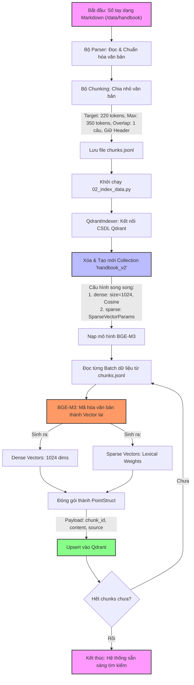
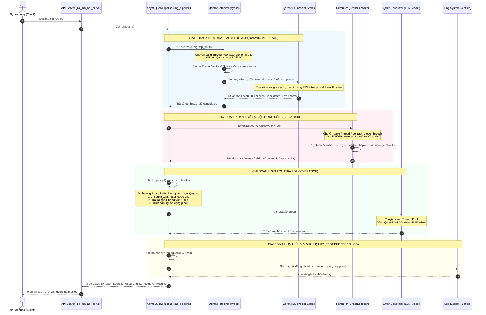

# TÀI LIỆU KỸ THUẬT: KIẾN TRÚC RAG VÀ HỆ THỐNG ĐÁNH GIÁ OFFLINE
**Clef Internal AI Chatbot (AI Module)**

Tài liệu này cung cấp mô tả chi tiết về cấu trúc luồng hoạt động RAG hiện tại và phương pháp đánh giá hiệu năng offline tự động cùng các liên kết tham chiếu khoa học chính thống.

---

## 1. TỔNG QUAN KIẾN TRÚC RAG (PIPELINE ARCHITECTURE)

Hệ thống RAG sử dụng chiến lược **Tìm kiếm lai kết hợp (Advanced Hybrid Search)** kết hợp **Đánh giá lại (Reranking)** và mô hình sinh **LLM cục bộ (Local LLM)** nhằm tối ưu hóa độ chính xác và tốc độ phản hồi.

*   **Mô hình nhúng (Embedding Model):** `BAAI/bge-m3` (Sinh song song Dense & Sparse Vector).
*   **Cơ sở dữ liệu Vector (Vector Store):** `Qdrant` (Collection: `handbook_v2`, kết hợp kết quả bằng thuật toán `RRF`).
*   **Mô hình xếp hạng lại (Reranker Model):** `BAAI/bge-reranker-v2-m3` (CrossEncoder).
*   **Mô hình sinh câu trả lời (Generator LLM):** `Qwen/Qwen2.5-1.5B-Instruct` (Quantization 4-bit).

---

## 2. LUỒNG HOẠT ĐỘNG CHI TIẾT (WORKFLOW DIAGRAMS)

### A. Luồng Lập Chỉ Mục Dữ Liệu (Offline Indexing Pipeline)
Quy trình này chuẩn bị dữ liệu văn bản từ sổ tay công ty (Handbooks), thực hiện Chunking, tạo chỉ mục vector và nạp vào Qdrant.



### B. Luồng Truy Vấn Trực Tuyến (Online Query Pipeline)
Quy trình bất đồng bộ thực hiện tìm kiếm lai, xếp hạng lại và dùng LLM để tổng hợp câu trả lời dựa trên ngữ cảnh được cung cấp.



---

## 3. HỆ THỐNG ĐÁNH GIÁ HIỆN TẠI (EVALUATION FRAMEWORK)

Bộ chấm điểm offline được triển khai trong script `11_run_evaluation.py`. Bộ chấm điểm này hoạt động hoàn toàn cục bộ (offline), không tốn chi phí gọi API và tuân thủ các nguyên lý khoa học của **RAG Triad** (độ trung thực, độ liên quan, chất lượng ngữ cảnh).

### A. Các chỉ số đo lường Retrieval (Pre-Rerank & Post-Rerank)
Sử dụng dữ liệu Ground Truth (mã `Chunk ID` đúng lưu trong file `qa_dataset.md`) so khớp với danh sách Chunk ID tìm kiếm thực tế:

*   **Hit Rate@K (Tỷ lệ tìm trúng):** Đo lường xem tài liệu chính xác có nằm trong top K kết quả trả về hay không. Điểm số là 1.0 (nếu trúng) hoặc 0.0 (nếu trượt).
*   **NDCG@K (Normalized Discounted Cumulative Gain):** Đánh giá mức độ chính xác của thứ tự sắp xếp kết quả. Chunk đúng nằm ở vị trí cao hơn (vị trí 1, 2) sẽ đạt điểm số cao hơn so với khi nằm ở vị trí thấp (vị trí 4, 5).
*   **Context Precision (Độ chính xác của ngữ cảnh):** Tính toán tỷ lệ các chunks liên quan xuất hiện ở thứ hạng cao trên tổng số chunks được lấy ra.
*   **Context Recall (Độ bao phủ của ngữ cảnh):** Đánh giá xem lượng thông tin cần thiết để trả lời câu hỏi (Ground Truth) có được bao phủ đầy đủ trong các chunks đã truy xuất hay không.

### B. Các chỉ số đo lường Generation (Heuristics NLP)
Sử dụng các công thức xử lý ngôn ngữ tự nhiên (NLP) để chấm điểm câu trả lời sinh ra bởi LLM:

*   **Answer Correctness (Độ chính xác của câu trả lời):**
    *   *Thuật toán:* Trung bình cộng có trọng số:
        $$\text{Correctness} = 0.7 \times \text{ROUGE-L F1} + 0.3 \times \text{Jaccard Overlap}$$
    *   *Ý nghĩa:* ROUGE-L đo chuỗi con dài nhất trùng khớp để bảo toàn ngữ nghĩa, Jaccard đo độ bao phủ từ vựng thô.
*   **Faithfulness (Độ trung thực / Chống ảo tưởng):**
    *   *Thuật toán:* Phân tách câu trả lời của AI thành các câu đơn. Một câu đơn được coi là "được nâng đỡ/có căn cứ" nếu thỏa mãn:
        1.  Khớp chuỗi chính xác (Exact Match) trong Context.
        2.  Hoặc độ trùng lặp từ vựng (Token Overlap) $\ge 0.58$ so với Context.
        3.  Hoặc độ tương đồng ngữ nghĩa TF-IDF Cosine Similarity $\ge 0.38$.
    *   *Ý nghĩa:* Tính tỷ lệ phần trăm số câu của AI thực sự bắt nguồn từ tài liệu handbook nội bộ.
*   **Answer Relevancy (Độ liên quan):**
    *   *Thuật toán:* Lọc bỏ các từ dừng (stopwords) vô nghĩa trong câu hỏi (ví dụ: *là, gì, của, và, có...*). Tính trung bình có trọng số:
        $$\text{Relevancy} = 0.4 \times \text{Jaccard Overlap} + 0.6 \times \text{Keyword Recall}$$
    *   *Ý nghĩa:* Đo xem câu trả lời của AI có chứa các từ khóa cốt lõi của câu hỏi hay không.
*   **Answer Completeness (Độ đầy đủ ý):**
    *   *Thuật toán:* Tách câu trả lời chuẩn (Ground Truth) thành các câu đơn. Kiểm tra xem mỗi câu đơn có xuất hiện trong câu trả lời sinh ra của AI hay không (bằng so khớp chuỗi hoặc trùng lặp từ vựng $\ge 60\%$).

---

## 4. TÀI LIỆU THAM KHẢO CHÍNH THỐNG (OFFICIAL REFERENCES)

Dưới đây là các bài báo nghiên cứu khoa học và tài liệu kỹ thuật chính thức dùng làm cơ sở cho thuật toán chấm điểm hiện tại:

### A. Đo lường chất lượng câu từ (Generation Metrics)
1.  **ROUGE Metric (Recall-Oriented Understudy for Gisting Evaluation):**
    *   *Bài báo khoa học gốc (Lin, 2004):* [ROUGE: A Package for Automatic Evaluation of Summaries](https://aclanthology.org/W04-1013.pdf) (ACL Anthology).
    *   *Tài liệu thư viện Hugging Face:* [Hugging Face Space - ROUGE Space](https://huggingface.co/spaces/evaluate-metric/rouge).
2.  **BLEU Metric (Bilingual Evaluation Understudy):**
    *   *Bài báo khoa học gốc (Papineni et al., 2002):* [BLEU: a Method for Automatic Evaluation of Machine Translation](https://aclanthology.org/P02-1040.pdf) (ACL Anthology).
    *   *Tài liệu thư viện Hugging Face:* [Hugging Face Space - BLEU Space](https://huggingface.co/spaces/evaluate-metric/bleu).
3.  **Jaccard Similarity (Độ tương đồng tập hợp):**
    *   *Tài liệu định nghĩa toán học:* [Wikipedia - Jaccard Index](https://en.wikipedia.org/wiki/Jaccard_index).

### B. Đo lường công cụ tìm kiếm và truy xuất (Retrieval Metrics)
4.  **NDCG (Normalized Discounted Cumulative Gain):**
    *   *Tài liệu định nghĩa toán học:* [Wikipedia - Discounted Cumulative Gain](https://en.wikipedia.org/wiki/Discounted_cumulative_gain).
    *   *Tài liệu lập trình thư viện Scikit-Learn:* [Scikit-Learn ndcg_score API](https://scikit-learn.org/stable/modules/generated/sklearn.metrics.ndcg_score.html).
5.  **Cosine Similarity (Độ tương đồng góc Vector):**
    *   *Tài liệu định nghĩa toán học:* [Wikipedia - Cosine Similarity](https://en.wikipedia.org/wiki/Cosine_similarity).

### C. Khung lý thuyết RAG Triad (Mô hình bộ ba đánh giá RAG)
6.  **RAG Triad Framework (Định nghĩa bởi TruLens):**
    *   *Tài liệu khái niệm chính thức:* [TruLens - The RAG Triad Guide](https://www.trulens.org/trulens/concepts/rag_triad/).
7.  **Ragas Framework (Ragas Metrics):**
    *   *Tài liệu mô tả công thức các chỉ số Ragas:* [Ragas - Metrics Reference Documentation](https://docs.ragas.io/en/stable/concepts/metrics/index.html).

---

## 5. HƯỚNG DẪN CHẠY BỘ ĐÁNH GIÁ (RUNNER INSTRUCTIONS)

Để vận hành quy trình đánh giá offline này, bạn thực hiện chạy tuần tự các dòng lệnh sau từ thư mục gốc của dự án (`/home/phuongnha/SourcesCode/TLTN/tltn-internal-chat/AI Module`):

```bash
# Kích hoạt môi trường ảo Python
source venv/bin/activate

# 1. Tạo tập dataset QA ban đầu từ Handbook
python ai/scripts/03_generate_qa_dataset.py

# 2. Phân chia tập dataset thành tập Train/Test (Tùy chọn)
python ai/scripts/04_split_qa_dataset.py

# 3. Định vị lại các ChunkID đúng cho câu trả lời chuẩn (Ground Truths)
python ai/scripts/09_fix_ground_truths.py

# 4. Chạy Batch sinh câu trả lời tự động qua RAG Pipeline
python ai/scripts/10_batch_generate_qa.py

# 5. Chạy bộ chấm điểm offline tự động
python ai/scripts/11_run_evaluation.py

# 6. Vẽ biểu đồ so sánh kết quả
python ai/scripts/12_plot_results.py

# 7. Sinh giao diện HTML Dashboard trực quan kết quả đánh giá
python ai/scripts/13_generate_dashboard.py
```

Sau khi hoàn thành, bạn mở file `ai/logs/eval_dashboard.html` bằng trình duyệt web để theo dõi chất lượng toàn bộ hệ thống RAG một cách chi tiết nhất.
